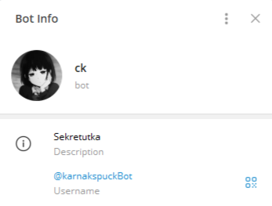

# Ck Secretary Bot: Умная секретарша в Telegram


**Ck Secretary Bot** — это Telegram-бот aka секретарша, оснащённая искусственным интеллектом на базе Ollama, которая помогает управлять доступом к вашему личному каналу. Бот анализирует запросы от пользователей и решает, предоставить им доступ, основываясь на том, содержит ли их сообщение смешной мем или нет. Кроме того, бот может вести интересные беседы на любые темы, делая общение с посетителями канала более живым и увлекательным. Бот так же оснащен графовой базой данных для хранения данных общения с пользователем внутри сессии и хранения информации для RAG системы. Можно общаться с ботом как в режиме RAG, так и без него, тогда данные в базе данных не сохраняются даже внутри сессии.


## Функциональность

### Управление Доступом
Бот анализирует сообщения пользователей и определяет, стоит ли предоставлять им доступ к вашему личному каналу. Если сообщение содержит смешной мем в виде картинки, бот отправляет его владельцу канала с запросом - одобрить вступление или отклонить, если да - пользователь получает доступ. В противном случае, бот может предложить отправить более забавное сообщение или послать собеседника подождать в коридоре.

### Интерактивное Общение
Бот способен вести полноценные диалоги с пользователями, обсуждая любые темы. Это позволяет создать более дружественную и интересную атмосферу в вашем канале.

### Поддержка Базы Данных
Проект использует базу данных Neo4j для хранения информации о пользователях, их запросах и статусах доступа. Это обеспечивает эффективное управление данными и упрощает масштабирование.

## Технологии и Инструменты

### Язык Программирования и Библиотеки
- **Python**: Основной язык программирования проекта.
- **LangChain**: Пакеты для работы с RAG.
- **Neo4j**: База данных для хранения данных.
- **Pillow**: Для работы с изображениями.
- **Requests**: Для выполнения HTTP-запросов.
- **Python-Telegram-Bot**: Библиотека для создания Telegram-ботов.
- **Docker**: для каждого сервиса свой докер, почи все работают в одной сети.
- **Makefile**: как всегда, тестирование кода, запуск бота.

### Структура Проекта
```
├─ .dockerignore
├─ .git
├─ .gitignore
├─ api.Dockerfile
├─ api.py
├─ chains.py
├─ docker-compose.yml
├─ entrypoint.sh
├─ errors.md
├─ images
│  └─ datamodel.png
├─ install_ollama.sh
├─ loader.Dockerfile
├─ loader.py
├─ pull_model.Dockerfile
├─ requirements.txt
├─ utils.py
├─ telegram_bot
│  ├─ Makefile
│  ├─ commands.py
│  ├─ handlers.py
│  ├─ logger_config.py
│  ├─ main.py
│  ├─ message_config.py
│  ├─ requirements.txt
│  ├─ telegram_bot.Dockerfile
│  └─ utils.py
└─ wait-for-it.sh
```

### Инструменты Разработки
- **Makefile**: Для сборки и запуска проекта.
- **Dockerfile**: Для контейнеризации приложения.
- **pytest**: Для тестирования кода.
- **Pylint**: Для проверки стиля кода.
- **Isort**: Для автоматической сортировки импортов.

## Как Запустить

### Установка
1. Клонируйте репозиторий проекта.
2. Создайте необходимые файлы .env в корне проекта и в папке ./telegram-bot с токенами, id чатов и переменными окружения для работы llm.
3. Запустите докер:
   ```bash
   docker compose up --build
   ```


### Тестирование
Проект оснащён системой тестирования, которая проверяет корректность форматирование. Вы можете запустить тесты с помощью команды:
```bash
make check_lint
```
